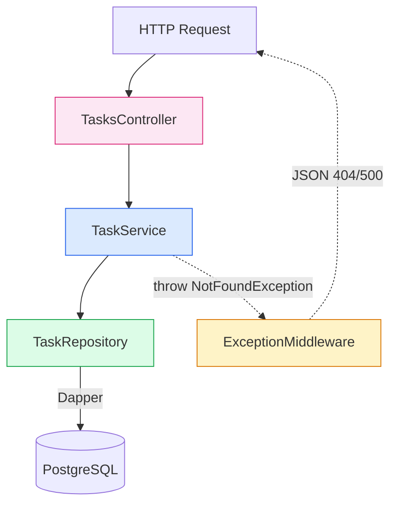

# Arquitectura del backend

Layered clásica en un solo proyecto. Tres capas, una sola dirección de dependencia.



## Responsabilidad por capa

- **Controller**: recibe la request, valida query params básicos y delega.
- **Service**: orquesta el repo y mapea `TaskItem` → `TaskDto`. Lanza `NotFoundException` cuando un id no existe.
- **Repository**: único lugar que conoce SQL. Usa Dapper para invocar `sp_get_tasks` y `sp_get_task_by_id`.
- **Middleware**: traduce excepciones a JSON consistente (status, title, detail, instance).

## Composición (`Program.cs`)

```csharp
builder.Services.AddSingleton<ITaskRepository, TaskRepository>();
builder.Services.AddScoped<ITaskService, TaskService>();
```

Repo Singleton porque no guarda estado (Npgsql tiene su propio pool). Service Scoped por request.

## Configuración

`DotNetEnv.Env.TraversePath().Load()` al arranque carga `.env` en variables de entorno. .NET las lee como `IConfiguration` con la convención `Section__Key` (ej. `ConnectionStrings__Default`). En producción se setean directamente en el container, sin archivo.
