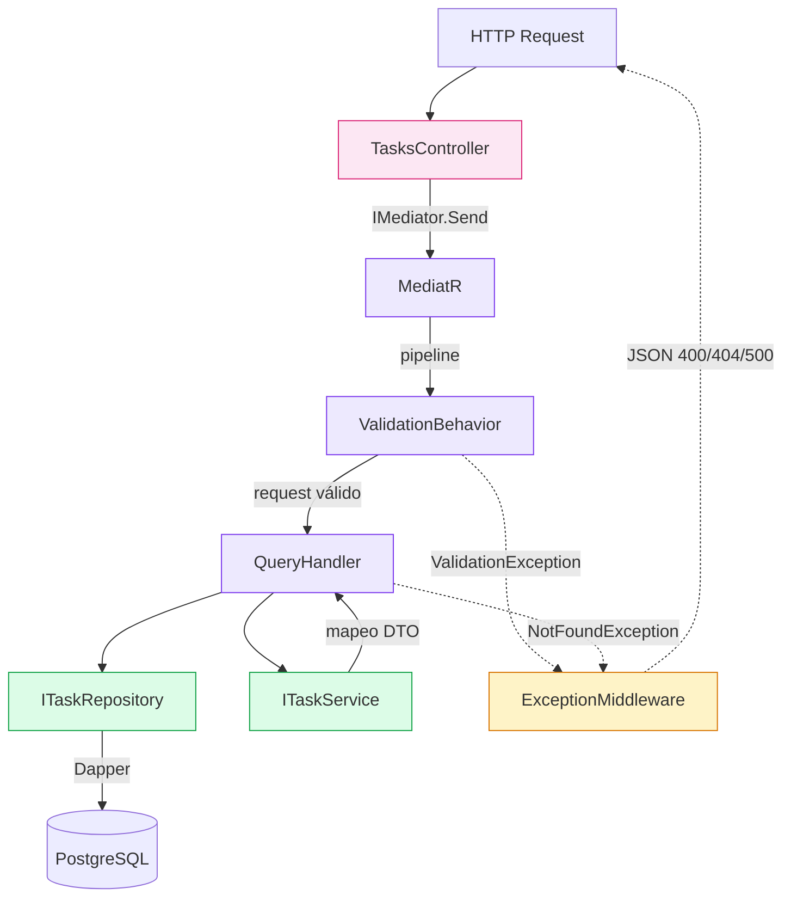

# Arquitectura del backend

Clean Architecture en un solo proyecto. Cuatro capas, dependencias siempre hacia adentro.



## Capas y responsabilidades

```
TaskManager.Api/
├── API/
│   ├── Controller/     ← recibe HTTP, despacha al mediator, devuelve IActionResult
│   └── Middleware/     ← ExceptionMiddleware: traduce excepciones a JSON
├── Application/
│   ├── Behaviors/      ← ValidationBehavior: corre FluentValidation antes de cada handler
│   ├── Commands/       ← definiciones de commands (escritura)
│   ├── CommandHandlers/← handlers de commands
│   ├── Query/          ← definiciones de queries (lectura)
│   ├── QueryHandlers/  ← GetTasksQueryHandler, GetTaskByIdQueryHandler
│   ├── Validators/     ← GetTasksQueryValidator, GetTaskByIdQueryValidator
│   ├── Dtos/           ← TaskListItemDto (listado), TaskDetailDto (detalle)
│   ├── Services/       ← ITaskService (interfaz de mapeo)
│   └── Exceptions/     ← ValidationException
├── Domain/
│   ├── Entities/       ← TaskItem (rich model), TaskStatus, TaskPriority (value objects)
│   ├── Repository/     ← ITaskRepository (interfaz)
│   └── Exceptions/     ← NotFoundException
└── Infrastructure/
    ├── Repository/     ← TaskRepository: Dapper + sp_get_tasks / sp_get_task_by_id
    ├── Service/        ← TaskService: mapea TaskItem → DTO
    └── Persistence/    ← TaskRow: POCO plano para Dapper
```

- **Controller**: construye el `IRequest` y llama a `_mediator.Send`. Sin validación, sin repositorio, sin mapeo.
- **ValidationBehavior**: intercepta cada request antes del handler y corre los `AbstractValidator` correspondientes. Si hay error lanza `ValidationException` → HTTP 400.
- **QueryHandler**: orquesta el caso de uso. Llama al repositorio para traer entidades de dominio y al service para mapearlas al DTO correcto.
- **Repository**: único lugar que conoce SQL/Dapper. Llama a los stored procedures e hidrata `TaskRow`, luego mapea a `TaskItem` antes de retornar.
- **TaskService**: mapea `TaskItem` → `TaskListItemDto` o `TaskDetailDto`. Vive en Infrastructure porque conoce los dos lados.
- **ExceptionMiddleware**: único punto de traducción de excepciones a JSON con formato consistente (`status`, `title`, `detail`, `instance`).

## Configuración

`DotNetEnv.Env.TraversePath().Load()` al arranque carga `.env` en variables de entorno. .NET las lee como `IConfiguration` con la convención `Section__Key` (ej. `ConnectionStrings__Default`). En producción se setean directamente en el container, sin archivo.
