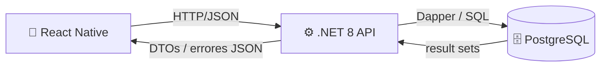
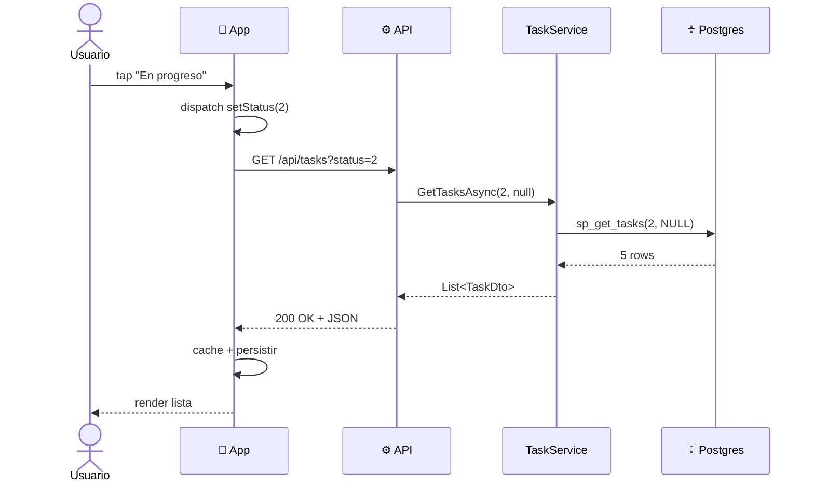
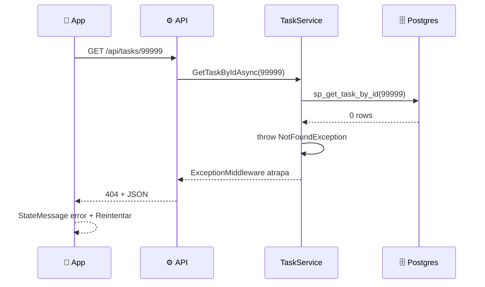

# Comunicación: app ↔ API ↔ DB

## Caso típico: filtrar por estado

## Caso de error: 404

## Contratos en cada hop

| Hop | Forma | Donde vive |
|---|---|---|
| App → API | Query string (`?status=2`) | `tasksApi.ts` |
| API → DB | Función SQL parametrizada | `TaskRepository.cs` |
| DB → API | Result set joineado | `db/03_functions.sql` |
| API → App | JSON con shape `TaskDto` | `Dtos/TaskDto.cs` |
| App interno | `Task` (entity de dominio) | `TaskMapper.toTask` en `transformResponse` |

Cualquier cambio en uno de estos hops solo toca su archivo.

## Persistencia (mobile)

`redux-persist` con AsyncStorage guarda `filters` y el cache de `tasksApi`. Al reabrir la app sin internet, se ve la última lista cargada. Cuando vuelve la conexión, `refetchOnReconnect: true` la actualiza sola.
