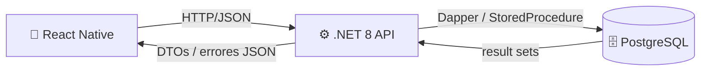
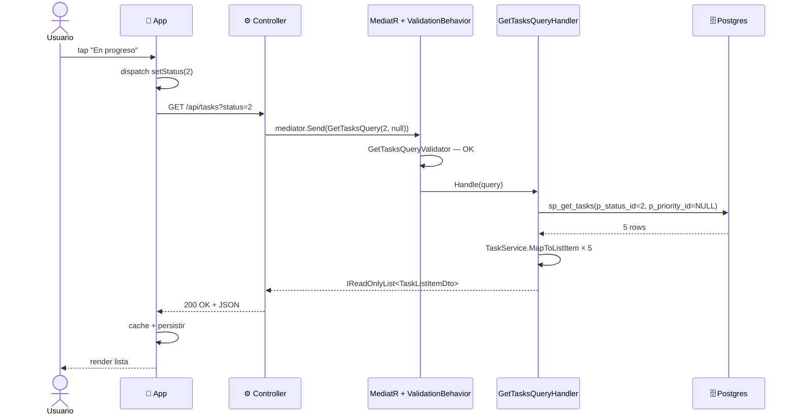
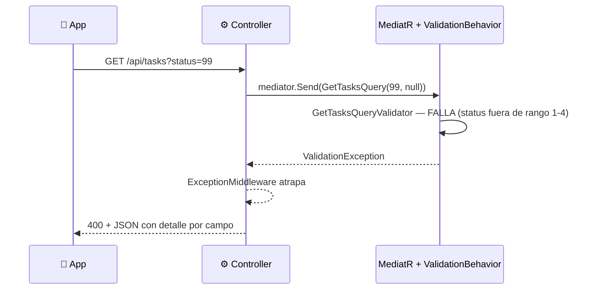
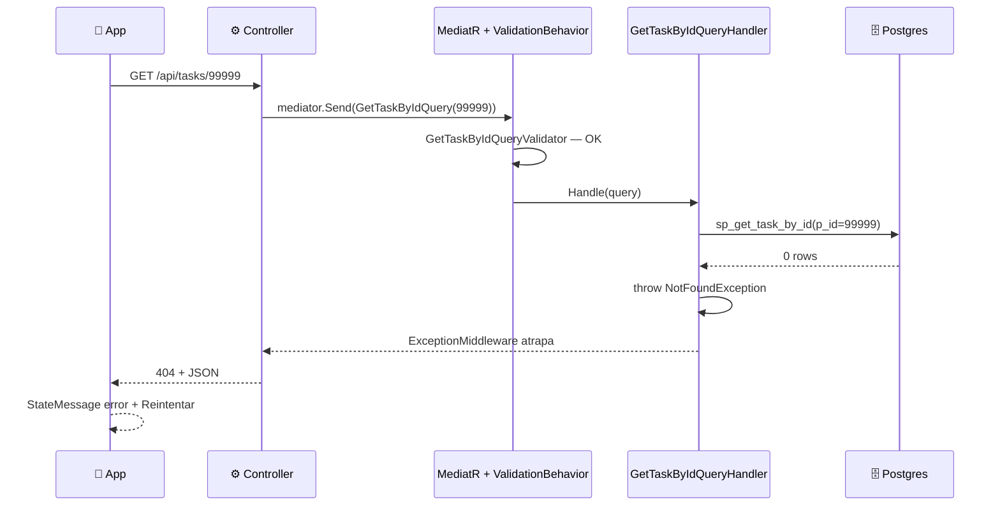

# Comunicación: app ↔ API ↔ DB

## Caso típico: filtrar por estado

## Caso de error: validación fallida (400)

## Caso de error: tarea no encontrada (404)

## Contratos en cada hop

| Hop | Forma | Donde vive |
|---|---|---|
| App → API | Query string (`?status=2`) | `tasksApi.ts` |
| API → MediatR | `GetTasksQuery` / `GetTaskByIdQuery` record | `Application/Query/` |
| MediatR → Handler | request validado por pipeline | `Application/Behaviors/ValidationBehavior.cs` |
| Handler → DB | Stored procedure parametrizado | `Infrastructure/Repository/TaskRepository.cs` |
| DB → Handler | Result set joineado → `TaskRow` → `TaskItem` | `db/03_functions.sql` + `TaskRepository.cs` |
| Handler → API | `IReadOnlyList<TaskListItemDto>` / `TaskDetailDto` | `Application/Dtos/` |
| API → App | JSON con shape del DTO | Swagger / `tasksApi.ts` |
| App interno | `Task` (entity de dominio mobile) | `TaskMapper.toTask` en `transformResponse` |

Cualquier cambio en uno de estos hops solo toca su archivo.

## Persistencia (mobile)

`redux-persist` con AsyncStorage guarda `filters` y el cache de `tasksApi`. Al reabrir la app sin internet, se ve la última lista cargada. Cuando vuelve la conexión, `refetchOnReconnect: true` la actualiza sola.
